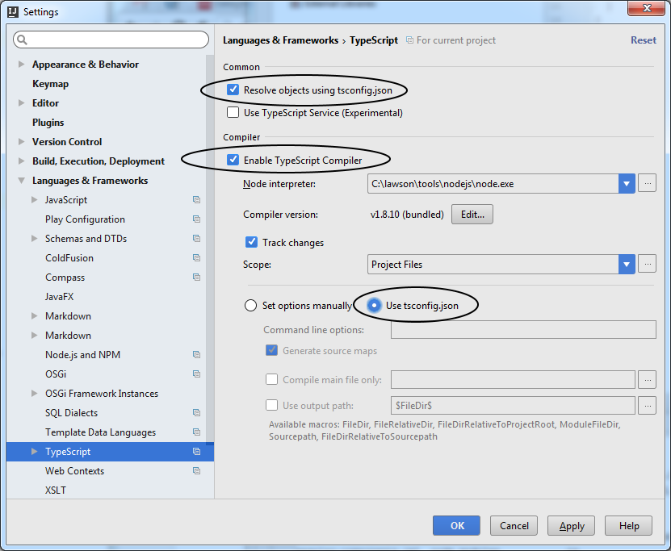

# Project Setup mike
1. make sure the latest node is installed (https://nodejs.org/en/download/current/)
2. run `npm config list` : there should be
```
; userconfig C:\Users\ppatton\.npmrc<br>
@infor:registry = "http://npm.infor.com:4873/"
registry = "https://registry.npmjs.org/"
```
3. If not then run ```npm set registry http://npm.infor.com:4873 --scope=@infor``` to add it to your .npmrc list
4. In the angular-component directory run ```npm install```

# Compiling typescript
## Command line users
1. Install typescript globally `npm install -g typescript@1.8.9`
2. Install typings for typescript `npm install -g typings@0.6.8`
3. cd to your projects `angular-component/ts` directory
4. run `tsc` to compile or `tsc -w` to keep it running and compiling as you make changes.

## Intellij 2016 Users:
1. File -> Settings... -> Language and Frameworks -> Typescript
2. Check `Resolve Object using tsconfig.json`
3. Check `Enable typescript compiler`
4. Select `Use tsconfig.json`
5. Click `OK` to close settings



# Start Server and Run
1. From command line or terminal run `node app`
2. http://localhost:3000


#Window git push error on forked repository

If you get an error like this:

`
error: failed to execute prompt script (exit code 1)
fatal: could not read Password for 'http://khollenbeck@gi
t.infor.com': No error
`

Run this command to resolve this issue. Make sure the path to git-gui is correct.

`git config --global core.askpass "C:/Program Files/Git/mingw64/libexec/git-core/git-gui--askpass"`
